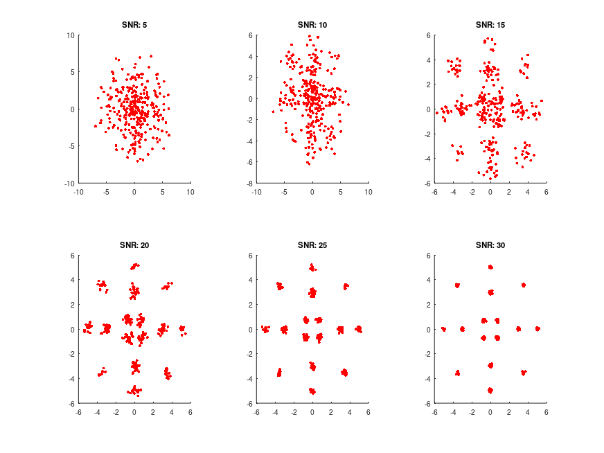

# digital_modulations_final
 Research assignment regarding digital modulations and modulation recognition algorithms
 
 This is part of a research assignment during the 6th semester of my studies at the Aristotle University of Thessaloniki, for the subject of ***Digital Communications II***, in collaboration with **Anestis Kaimakamidis - anestiskaim11**.
 
## Octave 
The Octave part consists of scripts that allowed us to create images of a digital modulation constellation, like the 16-APSK one:

The last script allowed us to make training and testing datasets for the Python part of the assignment.

## Python
This part was devoted to replicating an algorithm by Lee et al. *https://ieeexplore.ieee.org/document/8669036*
After this, our team tried improving it by making a secondary Deep Neural Network, that only helped when it detected two certain types of modulations. We did the same with a Support Vector Machine, and combined the two confidence scores using various methods (and with various results).

We hope we will be able to expand our research in the foreseeable future.

### Antonios Antoniou - aantonii@ece.auth.gr - tonyantonioy@yahoo.com
### Anestis Kaimakamidis - anestisk@ece.auth.gr
